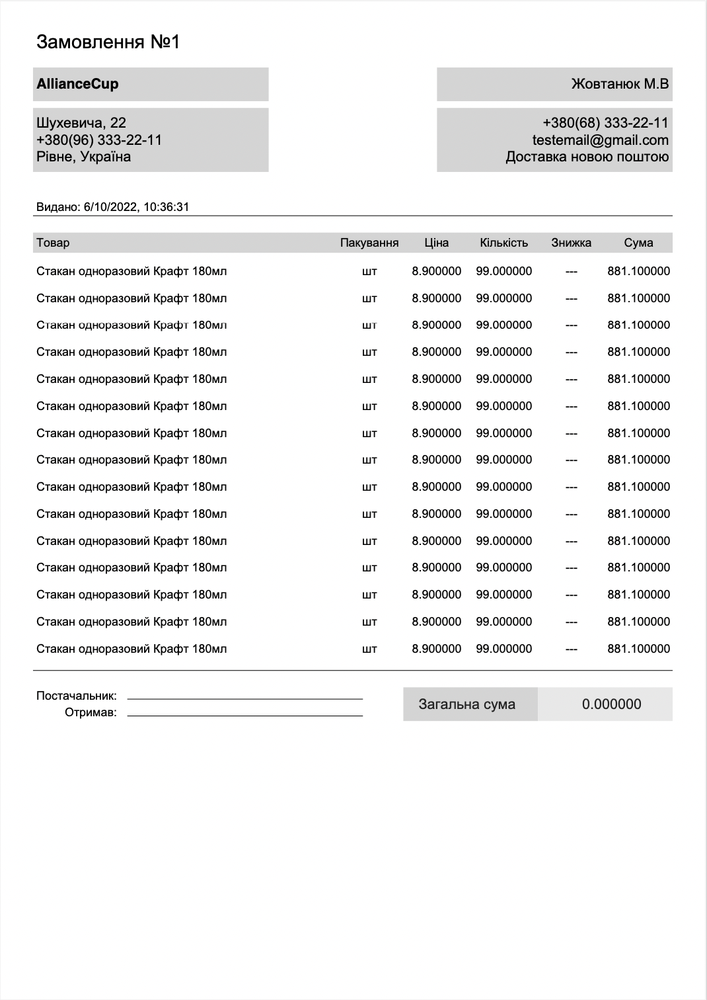

## `go-invoice`

---

Basic Go package for invoice generation using   
https://github.com/jung-kurt/gofpdf  
https://github.com/angelodlfrtr/go-invoice-generator - inspiration

```shell
go get -u github.com/maxzhovtyj/go-invoice
```
---
* Package supports both english and ukrainian 

---

## Example output

---



### Example:
```go
package main

import (
	"fmt"
	goinvoice "github.com/maxzhovtyj/go-invoice"
	"os"
)

func main() {
	pwd, err := os.Getwd()
	if err != nil {
		fmt.Println(err)
		os.Exit(1)
	}

	doc, err := goinvoice.NewWithCyrillic(pwd)
	if err != nil {
		return
	}

	doc.Language = "UK"
	doc.SetPwd(pwd)

	doc.OrderId = "1"

	doc.SetInvoice(&goinvoice.Invoice{
		Logo:  nil,
		Title: "Alliance Cup",
	})

	doc.SetCompany(&goinvoice.Company{
		Name:        "AllianceCup",
		Address:     "Шухевича, 22",
		PhoneNumber: "+380(96) 333-22-11",
		City:        "Рівне",
		Country:     "Україна",
	})

	doc.SetCustomer(&goinvoice.Customer{
		LastName:     "Жовтанюк",
		FirstName:    "Максим",
		MiddleName:   "В'ячеславович",
		PhoneNumber:  "+380(68) 333-22-11",
		Email:        "testemail@gmail.com",
		DeliveryType: "Доставка новою поштою",
		//DeliveryInfo: "м.Рівне, відділення №12",
	})
	for i := 0; i < 15; i++ {
		doc.AppendProductItem(&goinvoice.Product{
			Title:     "Стакан одноразовий Крафт 180мл",
			Price:     8.9,
			Quantity:  99,
			Packaging: "шт",
		})
	}

	pdf, err := doc.BuildPdf()
	if err != nil {
		fmt.Println(err.Error())
		return
	}

	err = pdf.OutputFileAndClose("output.pdf")
	if err != nil {
		fmt.Println(err.Error())
		return
	}
}
```
